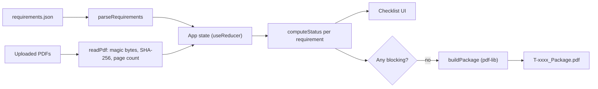

# Tender Document Package Builder: Plan

A frontend-only Vite + React + TypeScript + Tailwind app, deployed to Vercel. Office staff load `requirements.json`, upload PDFs, match each file to a requirement, enter expiry dates, and see live statuses. When nothing is blocking, they generate and download one ordered, footered package named `<tender_id>_Package.pdf`. All PDF work happens in the browser with pdf-lib. Bonus tasks will be chosen after the main tasks work.

## Tasks

- [ ] Scaffold Vite + React + TS + Tailwind, pdf-lib and a Bangla font; make the first commit and an early Vercel deploy
- [ ] Implement the types, `parseRequirements` (validate + sort by order), `TenderSummary`, and the i18n skeleton (en/bn + toggle)
- [ ] Implement `readPdf` (magic bytes, SHA-256, page count, error catch) and the uploader with rejection, the 30 files / 50 MB limits, and remove
- [ ] Build the checklist: match selects (1:1, undo, duplicate locking), expiry date inputs, `computeStatus` badges
- [ ] Implement `buildPackage`: English cover, ordered pages, "Page X of Y" footer band; Generate gate with reasons; download `<tender_id>_Package.pdf`
- [ ] Complete all Bangla strings for labels, buttons, messages, statuses and instructions
- [ ] Run the sample pack end to end, save `output/T-2026-0417_Package.pdf`, and take `screenshots/`
- [ ] Write the README per rulebook 9.3, make the final commit with the prompt in the message, and do the final Vercel deploy before T+90
- [ ] Pick and implement bonus tasks only after the main tasks pass verification

## 1. What the sample pack tests

Requirements file: tender `T-2026-0417`, submission deadline `2026-10-20`, 10 requirements (R06 and R07 are optional).

Each file in `docs/problem-pack/sample-pack/documents/`, what it really is, and the trap it sets:

- `trade_license_2025.pdf`: expires 2025-06-30. **Expired** if it is matched to R01.
- `trade_license_2026.pdf`: expires 2027-06-30. This is the correct file for R01.
- `experience_cert.pdf` and `experience_cert (1).pdf`: identical content (same MD5). **Duplicate**, so only one may be matched.
- `scan_0042.pdf`: an image-only scan with no text layer. It is actually the **Signed Declaration** (R10), so its name hides what it is. The user needs a preview to recognise it.
- `01_financial_proposal.pdf` (2 pages) and `02_technical_proposal.pdf` (6 pages): the number prefixes don't match the tender order (Financial is order 9, Technical is order 8). The package must sort by `order`, never by file name.
- `03_tin_certificate.pdf` and `04_vat_certificate.pdf`: these prefixes don't match the tender order either (TIN is 2, VAT is 3).
- `bank_solvency.pdf`: expires 2026-12-31, so it is OK. The date has to be typed in by the user.
- `company_logo.png`: not a PDF. It must be **rejected** with a clear message. It could later serve as the bonus seal image.

Statuses expected after the user matches the files correctly:

- **OK:** R01, R02, R03, R04, R05, R08, R09, R10
- **Not provided:** R06 (Audited Financial Statement) and R07 (Manufacturer's Authorization)
- **Left unused:** `trade_license_2025.pdf` and `experience_cert (1).pdf`
- **Package size:** 1 cover page plus 15 document pages, so **16 pages** in total (17 if the bonus index page is added).

## 2. Architecture



Planned file layout under `src/`:

- `lib/types.ts`: the types `Tender`, `Requirement`, `UploadedFile` (`id`, `name`, `size`, `bytes`, `pageCount`, `hash`, `error?`), `Match` (requirementId to fileId), and `expiry` (requirementId to `YYYY-MM-DD`).
- `lib/requirements.ts`: `parseRequirements(json)` validates the fields, sorts by `order`, and returns clear bilingual errors when the file is invalid.
- `lib/pdfFiles.ts`: `readPdf(file)` checks the extension, MIME type and the `%PDF-` magic bytes. It computes a hash with `crypto.subtle.digest('SHA-256')`, counts pages with `PDFDocument.load`, and catches load errors so a damaged or encrypted file shows an error instead of crashing.
- `lib/status.ts`: a pure function, `computeStatus(req, match, expiry, deadline)`.
- `lib/buildPackage.ts`: builds the cover page, adds each document's pages, and draws the footers.
- `i18n/strings.ts`: `en`/`bn` dictionaries plus a `useT()` hook. The chosen language is saved in `localStorage`, and `<html lang>` is updated to match.
- `components/`: `LanguageToggle`, `RequirementsLoader`, `TenderSummary`, `FileUploader`, `FileList`, `Checklist`, `GeneratePanel`.
- `App.tsx` lays out a single page as four numbered steps: **1 Load list, 2 Upload files, 3 Match and check, 4 Generate**.

Dependencies: `pdf-lib`. Previews use the built-in Chrome PDF viewer through `URL.createObjectURL` opened in a new tab, so `pdf.js` isn't needed for the main tasks. A Bangla web font (Noto Sans Bengali) is used for the interface.

## 3. Main tasks, each mapped to the spec

- **4.1 Load the list.** A file picker accepts `.json`. The app shows the tender ID, title, procuring entity, bidder and deadline. Requirements are listed sorted by `order`, with mandatory/optional and expiry badges.
- **4.2 Upload files.** Multi-select plus drag-and-drop. The list shows each file's name, page count and size, with a Remove button. Non-PDFs are rejected with a bilingual message that names the file. The app also enforces the limits of at most 30 files and 50 MB in total.
- **4.3 Match files.** Each requirement row in the checklist has a `<select>` listing the uploaded files. A file that is already used elsewhere is disabled and labelled "(used for R0x)". Choosing "-- none --" undoes a match. Changing a match clears that row's expiry date. Removing a file automatically removes its match.
- **4.4 Expiry dates.** An `<input type="date">` appears only when `has_expiry` is true and a file is matched.
- **4.5 Status.** Computed from state on every render, so it updates immediately after any change. Each status gets a coloured badge with an icon and a text label (not colour alone).
- **4.6 Duplicates.** Files with the same SHA-256 hash are grouped and shown as "Duplicate of X" in the file list. In the match dropdown, any file whose duplicate is already matched to another requirement is disabled.
- **4.7 Generate.** The button stays disabled while any requirement has a blocking status. A visible list underneath explains why, for example "Trade License: Expired (2025-06-30 is before 2026-10-20)".
- **4.8 Download.** The download is named `${tender_id}_Package.pdf`, created through a Blob and a temporary `<a download>` link.
- **4.9 Two languages.** A toggle in the header switches every label, button, message, instruction and status. Requirement names come from `title_bn` or `title_en` depending on the language.

### Status logic (`lib/status.ts`)

Dates are compared as `YYYY-MM-DD` strings, never as `Date` objects, so time zones can't cause errors.

```ts
if (!fileId) return req.mandatory ? 'MISSING' : 'NOT_PROVIDED';
if (req.has_expiry && !expiry) return 'EXPIRY_NEEDED';
if (req.has_expiry && expiry < deadline) return 'EXPIRED';
return 'OK';
```

- **Blocking statuses:** `MISSING`, `EXPIRY_NEEDED`, `EXPIRED`.
- **Edge cases:**
  - Expiring on the deadline day itself is OK.
  - An optional document that has a file but no date, or an expired date, still blocks. This follows the status table literally.

Bangla status labels:

- Missing: অনুপস্থিত
- Expiry date needed: মেয়াদের তারিখ দিন
- Expired: মেয়াদোত্তীর্ণ
- Not provided: দেওয়া হয়নি
- OK: ঠিক আছে

## 4. Package rules (`lib/buildPackage.ts`)

1. Create a new `PDFDocument`. Page 1 is an A4 **English** cover using Helvetica. It shows:
   - tender ID, title, procuring entity, bidder and deadline
   - the package date (today, in local `YYYY-MM-DD` format)
   - a numbered list of the included documents: `order`, `title_en`, file name and page count
2. For each requirement sorted by `order` that has a matched file, `copyPages` copies all of its pages in their original order. Optional requirements without a file are skipped.
3. **The footer never covers content.** Each copied page is extended by a 28 pt band at the bottom (`setMediaBox`/`setCropBox` to `y - 28` and `height + 28`). The footer is drawn inside that new white band, so the original content is never shrunk or overlapped. Pages with `/Rotate` are handled by placing the band on their visual bottom edge.
4. The footer reads `T-2026-0417 | Page X of Y` in Helvetica 9 pt, dark grey, centred. It is drawn on every page in a second pass, once the total Y is known.
5. Save the document, then trigger the download.

## 5. Compliance checklist (rulebook and problem statement)

- **Frontend only.**
  - No backend, serverless functions or database.
  - Files never leave the browser.
  - Vercel serves the static `dist/` folder only.
- **Start from zero.** All code is written during the contest. Starter tools like `npm create vite` are allowed.
- **Commits.**
  - At least one commit every 30 minutes, at least 3 in total.
  - Every message gives a short summary plus `Prompt: "<AI prompt>"`, or `Manual edit`.
  - No force-pushing and no history rewrites.
- **Repository.** The rulebook asks for a public repo named `devfest-<registration-number>`, but organisers now allow the participant's name instead (`devfest-<name>`). The repo has been renamed to `DJRCX/devfest-mahtabul-al-nahian` and the local `origin` points to it. `LICENSE` (MIT) already exists.
- **No secrets.** No API keys anywhere, and no `.env` files committed.
- **Required outputs.**
  - `output/T-2026-0417_Package.pdf`, generated from the sample pack.
  - `screenshots/`, with at least the checklist showing statuses, ideally in both languages.
- **README must include:**
  - name (registration number is no longer required)
  - the live HTTPS link
  - how to run it (`npm install`, `npm run dev`, `npm run build`)
  - main features and bonus features
  - known problems
  - AI tools used
  - the most useful prompt
- **Deployment.** A public HTTPS link on Vercel that opens in the latest Chrome with no login. Nothing may change after T+90.

## 6. 90-minute timeline

- **T+0 to T+20:** Scaffold Vite, React, TypeScript and Tailwind. Write the types, `parseRequirements`, the tender summary and the i18n skeleton. **Commit 1**, then deploy to Vercel early to confirm the pipeline works.
- **T+20 to T+45:** Build the uploader (rejection, limits, page count, hash, remove), the checklist with matching, expiry inputs, statuses and duplicate locking. **Commit 2.**
- **T+45 to T+65:** Build `buildPackage`, the Generate gate with its reasons, and the download. Complete the Bangla strings. **Commit 3**, then redeploy.
- **T+65 to T+80:** Run the full flow on the sample pack and check the 16-page output and every footer. Save the output to `output/` and take screenshots. Write the README. **Commit 4**, then do the final deploy.
- **T+80 to T+90:** Buffer. Make the final eligible commit, record the commit ID, and submit the form.
- **Bonus:** decided once the main tasks work. The cheapest candidates are auto-match, the index page, bad-file messages (already partly covered by `readPdf`) and CSV export.

## 7. Verification with the sample pack

- **Upload all 11 files.** The PNG is rejected, both experience certificates are flagged as duplicates, and the page counts read 2, 6, 1, 1, 1, 2, 2, 1, 1, 1.
- **Expired license.** Match `trade_license_2025.pdf` to R01 with 2025-06-30. The status shows Expired and Generate stays blocked. Switch to the 2026 file with 2027-06-30 and it becomes OK.
- **Deadline-day expiry.** Enter 2026-10-20 as an expiry date. The status is OK.
- **Final package.** It has 16 pages in order: cover, Trade License 2026, TIN, VAT, Bank Solvency, Experience (2 pages), Technical (6 pages), Financial (2 pages), Declaration. Every page has a readable footer that doesn't overlap content.
- **Language switch.** Switching to Bangla mid-flow keeps all state and translates every visible label.
