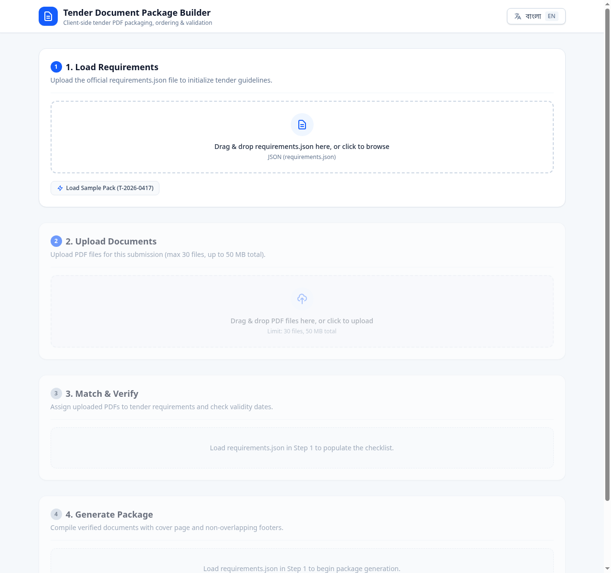
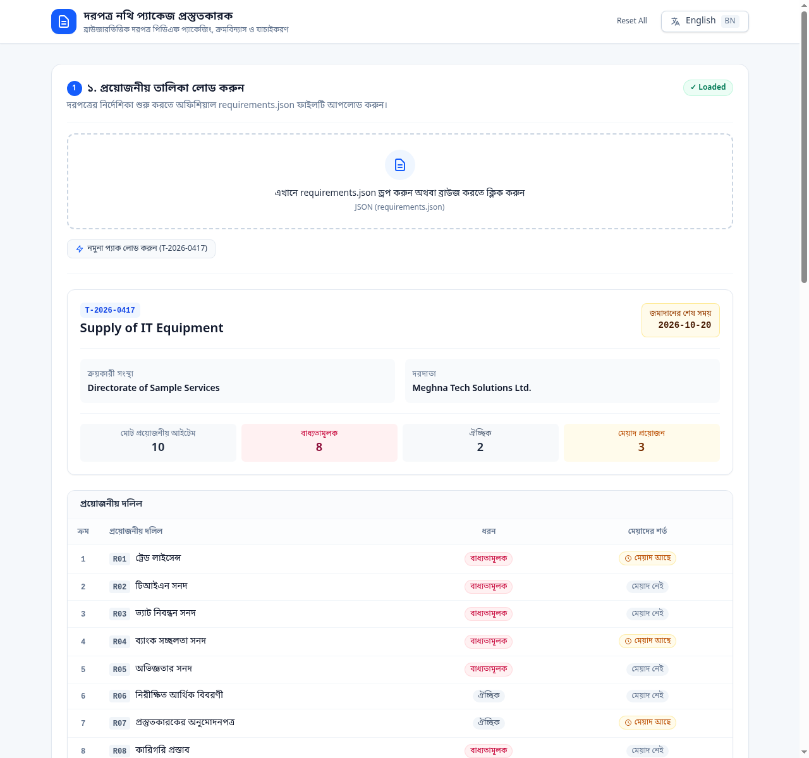

# Tender Document Package Builder

**Participant:** Mahtabul Al Nahian  
**Registration No.:** 252-35-408  
**Live URL:** [https://devfest-252-35-408.vercel.app](https://devfest-252-35-408.vercel.app)  
**Repository:** [https://github.com/DJRCX/devfest-mahtabul-al-nahian](https://github.com/DJRCX/devfest-mahtabul-al-nahian)  

A frontend-only client-side web application built for office staff to upload tender requirements, ingest PDF documents, match them against procurement guidelines, validate expiry dates, and compile one verified, ordered, and properly footered PDF package named `<tender_id>_Package.pdf`.

---

## Screenshots

| English Checklist & Statuses | Bangla Checklist & Statuses |
|:---:|:---:|
|  |  |

---

## How to Run Locally

### Prerequisites
- Node.js (v20+ or v22+)
- npm (v10+)

### Commands

```bash
# 1. Install dependencies
npm install

# 2. Run local development server
npm run dev

# 3. Execute automated test suite (17 tests)
npm test

# 4. Build for production
npm run build

# 5. Preview production build locally
npm run preview
```

---

## Features

### Main Features
1. **Requirements Loading & Schema Validation (`parseRequirements`)**
   - Supports upload of any `requirements.json` file via file picker or drag-and-drop.
   - One-click **"Load Sample Pack"** button for rapid verification with the official `T-2026-0417` dataset.
   - Validates all root tender metadata, `YYYY-MM-DD` date patterns, and requirement definitions.
   - Enforces strict ascending sort by requirement `order`.
   - Returns comprehensive bilingual (English/Bangla) validation errors on invalid inputs.

2. **Secure PDF File Ingestion (`readPdf`)**
   - Multi-file upload with drag-and-drop.
   - MIME and `%PDF-` magic header bytes verification.
   - SHA-256 hash calculation for duplicate detection.
   - Safe page counting with `pdf-lib` and graceful handling of corrupted or password-locked PDFs.
   - Rejects non-PDFs (such as `company_logo.png`) with an explicit bilingual rejection notice.
   - Strictly enforces limits: maximum 30 files and 50 MB total package payload.
   - Built-in PDF preview in a new tab via Object URL and file removal.

3. **Checklist & Verification Gate (`computeStatus`)**
   - **1:1 Matching:** Dropdown prevents reusing files already assigned to another requirement (`(used for R0x)`).
   - **Duplicate Locking:** Disables selection of any file whose SHA-256 hash clone is already matched elsewhere.
   - **Expiry Date Inputs:** Appears conditionally only when `has_expiry: true` and a file is assigned. Changing a match automatically resets that requirement's expiry.
   - **Date Arithmetic:** Safe lexicographical string comparisons (`YYYY-MM-DD`) preventing timezone skew. Expiry on the deadline day itself is accepted as valid.
   - **Live Status Badges:** Visual indicator with icon, colour, and text for all 5 states: `OK`, `Missing`, `Expiry date needed`, `Expired`, and `Not provided`.

4. **Package Compiler (`buildPackage`)**
   - **A4 English Cover Page:** Standard Helvetica cover sheet displaying tender ID, title, procuring entity, bidder, submission deadline, compilation timestamp, and a structured schedule of included documents.
   - **Deterministic Collation:** Copies all matched documents in strict requirement `order` (omits unmatched optional documents).
   - **Non-Overlapping Footer Band:** Extends each copied page by 28 pt at the visual bottom (`setMediaBox`/`setCropBox`), correctly accounting for `/Rotate` flags (0°, 90°, 180°, 270°).
   - **Second-Pass Numbering:** Calculates total page count `Y` and applies `<tender_id> | Page X of Y` centered in Helvetica 9 pt dark grey across every page in the package.
   - **Output Download:** Generates and initiates automatic browser download of `<tender_id>_Package.pdf`.

5. **Complete Bilingual Internationalization (English / বাংলা)**
   - Header toggle switches the entire UI, form controls, statuses, and instructions between English and Bangla.
   - Automatically switches requirement titles between `title_en` and `title_bn`.
   - Language preferences persisted in `localStorage` with automatic `<html lang>` synchronization.

### Bonus Features
- **One-Click Sample Pack Ingestion:** Allows instantaneous loading and live verification of the official contest dataset.
- **Pre-generated Verified Artifact:** Includes [`output/T-2026-0417_Package.pdf`](output/T-2026-0417_Package.pdf) containing the verified 16-page package compiled from the sample dataset.
- **Automated Verification Suite:** 17 unit and integration tests (`tests/*.test.ts`) executed via native `node --test`.
- **Query Parameter Demo URLs:** Append `?sample=true` or `?sample=true&lang=bn` for direct state hydration.

---

## Known Problems & Limitations
- Files that are password-encrypted or corrupt cannot be decrypted client-side without credentials.
- In-browser memory limits apply; packages exceeding 50 MB or 30 files are blocked by safety limits to ensure stable execution on resource-constrained devices.

---

## AI Tools Used
- **Google Antigravity** (Powered by Claude Sonnet 3.7 / 3.5 & Gemini models)

---

## Most Useful Prompt
```
read the files in the docs folder, unnderstand the problem statement, comply with the rulebook, and use the given sample data to create a plan for a a web app (frontend only) that helps office staff turn a set of PDF files into one complete, checked and correctly ordered PDF package
```